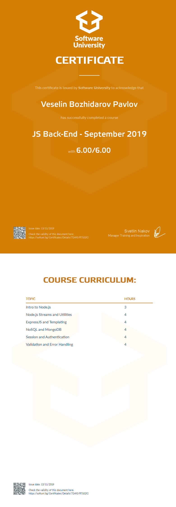

<a href="https://softuni.bg/trainings/courses" rel="Courses">  ![SoftUni logo][logo] <a/>

[logo]: http://innovationstarterbox.bg/wp-content/uploads/2016/05/Softuni_logo_trasparent.png "Logo Title Text 2"

---

# Course: JS Back-End

## Topics:
01. Intro to Node.js
02. Node.js Streams and Utilities
03. Express.js and Templating
04. Mongodb and Mongoose
05. Session and Authentication
06. Validation and Error Handling
07. REST API

## Certificate: 

